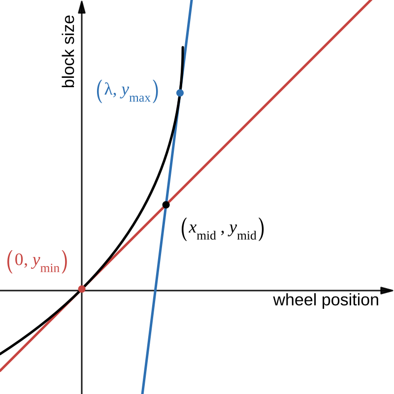

# Zoom

This page explains about some variables of `zoom.ts`.

## Concepts

Consider the relationship between `blockSize` and `wheelPos`.

In many top-down 2D games, this relationship is not linear. The larger the block size, the greater the magnification scale per wheel step.

On this page, we describe how the relationship between `blockSize` and `wheelPos` is modeled using a quadratic Bézier curve.

## Parameters and notations

Parameters : $\{y_\text{min},y_\text{max},\Delta_A,\Delta_B,\lambda\}$.

The wheel position ranges from $0$ to $\lambda$. When the wheel positions are $0$ and $\lambda$, the block sizes are $y_\text{min}$ and $y_\text{max}$, respectively.

The slopes, $\Delta_A$ and $\Delta_B$, represent the magnification scale per wheel step when the block size are $y_\text{min}$ and $y_\text{max}$, respectively.

| Math Notation  | Code Variable  |
| -------------- | -------------- |
| $y_\text{min}$ | `minBlockSize` |
| $y_\text{max}$ | `maxBlockSize` |
| $\Delta_A$     | `slopeA`       |
| $\Delta_B$     | `slopeB`       |
| $\lambda$      | `lambda`       |

## Constraints

The desired Bézier curve is given in the explicit form as $y=f(x)$. Additionally, this function needs to satisfy the following conditions:

- It must be monotonically increasing
- It must be convex

As a result, the following constraints must hold:

$$
\begin{gather}
1 \le y_\text{min}< y_\text{max} \\
0 <\Delta_A  <\Delta_B \\
\frac{y_\text{max}-y_\text{min}}{\Delta_B} < \lambda < \frac{y_\text{max}-y_\text{min}}{\Delta_A}
\end{gather}
$$

## Expressing the Bézier Curve in Parametric Form

The Bézier curve we are solving, is tangent to two straight lines, $\ell_A$ and $\ell_B$, at start point and end point.

$$
\begin{align}
\ell_A&:y-y_\text{min} =\Delta_A\ x \\
\ell_B&:y-y_\text{max} =\Delta_B\ (x - \lambda)
\end{align}
$$

The intersection $(x_\text{mid}, y_\text{mid})$ of $\ell_A$ and $\ell_B$ is

$$
\begin{align}
x_\text{mid}&=\frac{\lambda \Delta_B+y_\text{min}-y_\text{max}}{\Delta_B-\Delta_A} \\
y_\text{mid}&=\Delta_A\ x_\text{mid}+y_\text{min}
\end{align}
$$

The control points of the curve are $(0,y_\text{min})$, $(\lambda,y_\text{max})$, and $(x_\text{mid}, y_\text{mid})$. Now, we can describe the Bézier curve as parametric equation using these control points as follows

$$
\begin{align}
x&=t^2\left(\lambda-2x_\text{mid}\right)+2t\,x_\text{mid}\\
y&=t^2\left(y_\text{max}-2y_\text{mid}\right)+2t\,y_\text{mid}
\end{align}
$$

where $t$ is a parameter that ranges from $0$ to $1$.

## Expressing the Bézier Curve in Explicit Form

Consider a function of the form $f(x)=y$.

To begin with, we first examine a function of the form $g(x)=t$. From equation $(8)$, it can be expressed as follows.

$$
\begin{align}
\left(t+\frac{x_\text{mid}}{\lambda-2x_\text{mid}}\right)^2=\frac{x}{\lambda-2x_\text{mid}}+\left(\frac{x_\text{mid}}{\lambda-2x_\text{mid}}\right)^2
\end{align}
$$

Now we need to determine whether $h(\lambda)=x_\text{mid}/(\lambda-2x_\text{mid})$ is positive or negative. Using equation $(6)$, we can expand this expression as follows:

$$
\begin{align}
h(\lambda)=-\frac{\Delta_B\lambda+y_\text{min}-y_\text{max}}{\lambda(\Delta_A+\Delta_B)+2(y_\text{min}-y_\text{max})}
\end{align}
$$

The function $h(\lambda)$ is a typical rational function.

The vertical asymptote of a rational function occur only when the denominator is zero. Thus, the function $h(\lambda)$ has a vertical asymptotes at $\lambda=a_\lambda$, where

$$
\begin{align}
a_\lambda=2\cdot\frac{y_\text{max}-y_\text{min}}{\Delta_A+\Delta_B}
\end{align}
$$

Since the degrees of the numerator and denominator of $h(\lambda)$ are the same, its horizontal asymptote $y=a_y$ is given by the ratio of the coefficients of $\lambda$ as follows:

$$
\begin{align}
a_y=-\frac{\Delta_B}{\Delta_A+\Delta_B}
\end{align}
$$

When $\lambda$ approaches $a_\lambda$ from the right, $h(\lambda)$ behaves as follows:

$$
\begin{align}
\begin{split}
\lim_{\epsilon\to+0}h(a_\lambda+\epsilon)&=\lim_{\epsilon\to+0}\left[-\frac{\displaystyle 2\Delta_B\frac{y_\text{max}-y_\text{min}}{\Delta_A+\Delta_B}+\epsilon\Delta_B+y_\text{min}-y_\text{max}}{\epsilon(\Delta_A+\Delta_B)}\right] \\
&=\lim_{\epsilon\to+0}\frac{\displaystyle (y_\text{max}-y_\text{min})\left(\frac{2\Delta_B}{\Delta_A+\Delta_B}-1\right)}{-\epsilon}
\end{split}
\end{align}
$$

From constraints $(1)$ and $(2)$, we see $y_\text{max}-y_\text{min}>0$ and $(2\Delta_B)/(\Delta_A+\Delta_B)>1$. Thus, when $\epsilon\to+0$ then $h(a_\lambda+\epsilon)\to-\infty$. Similarly, when $\epsilon\to-0$ then $h(a_\lambda+\epsilon)\to+\infty$.

Next, determine the range of $h(\lambda)$ under the constraints given in $(3)$.

From constraints $(1)$ and $(2)$, the domain of $\lambda$, given in $(3)$, includes $a_\lambda$.

$$
\begin{align}
\frac{y_\text{max}-y_\text{min}}{\Delta_B} < a_\lambda < \frac{y_\text{max}-y_\text{min}}{\Delta_A}
\end{align}
$$

When we assign the lower and upper limits of the domain of $\lambda$ to $h(\lambda)$, it takes the following values:

$$
\begin{align}
h\left(\frac{y_\text{max}-y_\text{min}}{\Delta_B}\right)&=0 \\
h\left(\frac{y_\text{max}-y_\text{min}}{\Delta_A}\right)&=-1
\end{align}
$$

Thus, range of $h(\lambda)$ is as follows:

- On the left side of $\lambda=a_\lambda$, we have $0<h(\lambda)$.
- On the right side, we have $h(\lambda) < -1$.

For all $0\le t\le 1$, $t+h(\lambda)$ behaves as follows:

$$
\begin{align}
t+h(\lambda)
\begin{cases}
>0 & (\lambda < a_\lambda) \\
<0 & (\lambda > a_\lambda)
\end{cases}
\end{align}
$$

From equations $(10)$ and $(18)$, we have

$$
\begin{align}
t(x)=-\frac{x_\text{mid}}{\lambda-2x_\text{mid}}
\begin{cases}
\displaystyle +\sqrt{\frac{x}{\lambda-2x_\text{mid}}+\left(\frac{x_\text{mid}}{\lambda-2x_\text{mid}}\right)^2} & \displaystyle\left(\lambda < 2\cdot\frac{y_\text{max}-y_\text{min}}{\Delta_A+\Delta_B}\right) \\
\displaystyle -\sqrt{\frac{x}{\lambda-2x_\text{mid}}+\left(\frac{x_\text{mid}}{\lambda-2x_\text{mid}}\right)^2} & \displaystyle\left(\lambda > 2\cdot\frac{y_\text{max}-y_\text{min}}{\Delta_A+\Delta_B}\right)
\end{cases}
\end{align}
$$

Now, Using equation $(9)$, we can explicitly express $y$.
